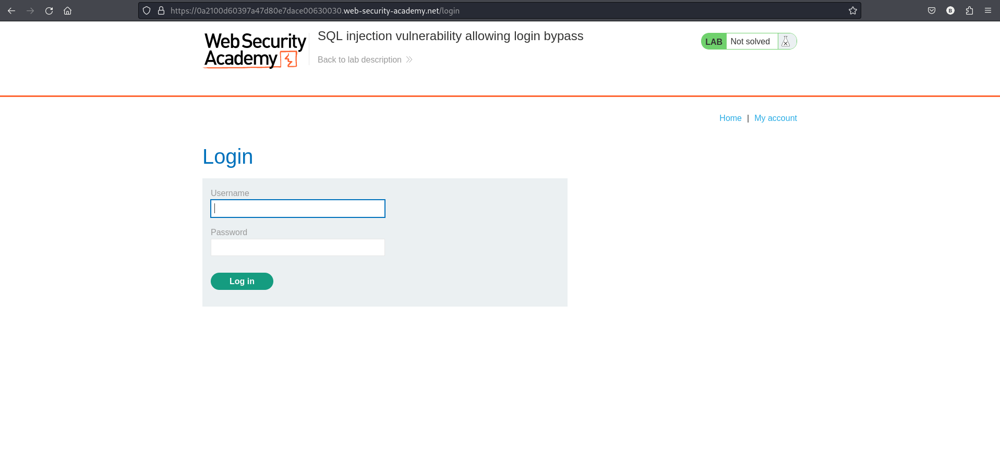
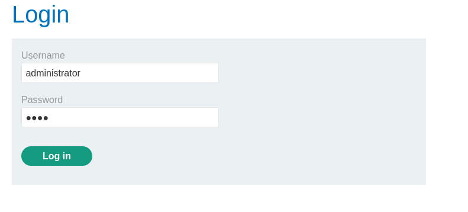
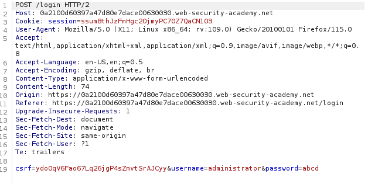
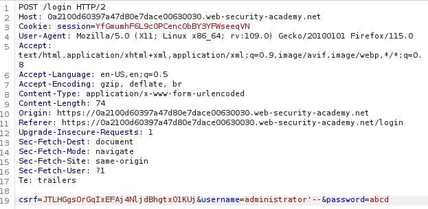
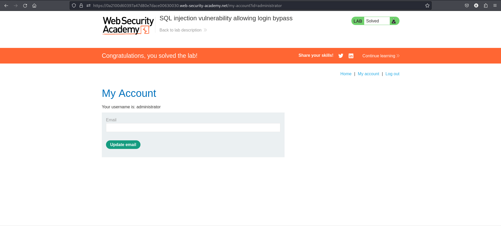

# This lab contains a SQL injection vulnerability in the login function.
## To solve the lab, perform a SQL injection attack that logs in to the application as the administrator user.

## Step1....Visit login page


## step 2....login using user id: administrator.


- this displays a incorrect id or password.

## step 3: Let’s craft a payload to bypass this login as administrator.
- we intercept request of login using burpsuite and inject SQL query which directly login as admin.
- normal request looks like this:


## step 4 :modify username
```
administrator' --
```


- this will directly login as a administrator.

## lab solved


