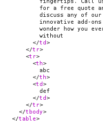
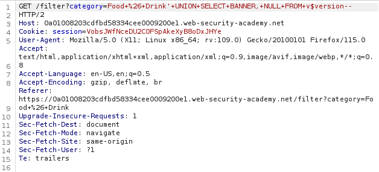
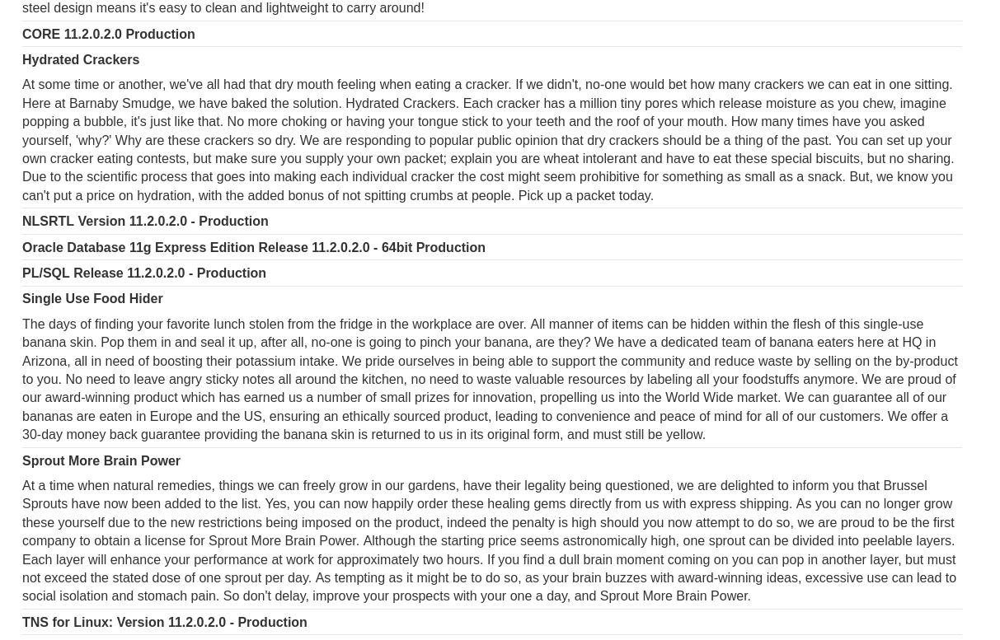

This lab contains a SQL injection vulnerability in the product category filter.
You can use a UNION attack to retrieve the results from an injected query.
- We have to get the type and version of the oracle database.

- Knowing about the database type and version of software and the number of columns contains by a database  is important for a SQLi.

For a ```UNION``` query to work, two key requirements must be met:

- The individual queries must return the same number of columns.
- The data types in each column must be compatible between the individual queries.

To carry out a SQL injection UNION attack, make sure that your attack meets these two requirements. This normally involves finding out:

- How many columns are being returned from the original query.
- Which columns returned from the original query are of a suitable data type to hold the results from the injected query.

In order to find number of columns we can use ```order by``` query.
- ```' ORDER BY 1--```
- ```' ORDER BY 2--```
- ```' ORDER BY 3--```, etc


# Step 1 : check column
- When we check for 3 columns it shows internal error.

- so there exists a two column.

Now we found columns. We need to find which column has data. <br>
On Oracle, every ```SELECT``` query must use the FROM keyword and specify a valid table. There is a built-in table on Oracle called ```dual``` which can be used for this purpose. So the injected queries on Oracle would need to look like:

## step 2: 
- Verify that the query is returning two columns, both of which contain text, using a payload
```' UNION SELECT NULL FROM DUAL--```



# Step 4:
- Use the following payload to display the database version:
```
'+UNION+SELECT+BANNER,+NULL+FROM+v$version--
```




